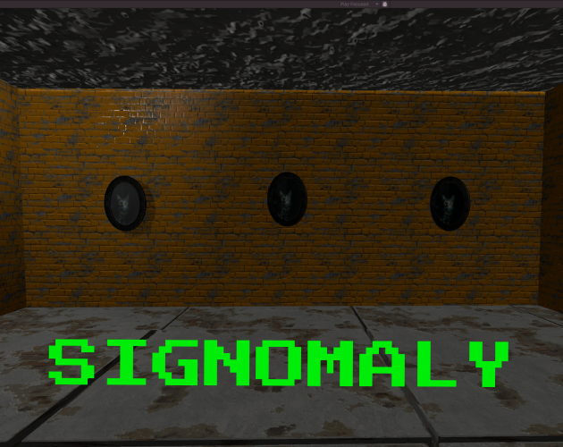
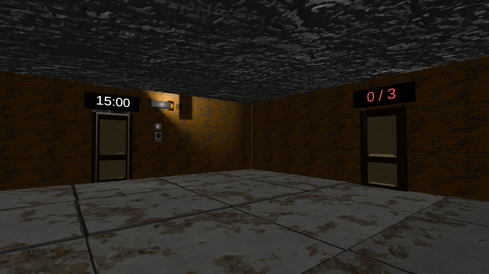
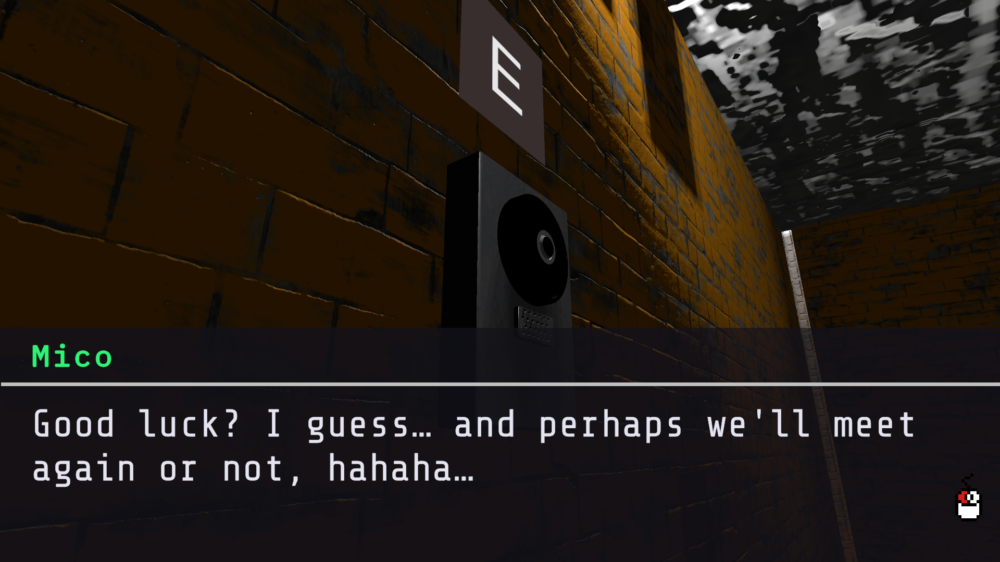
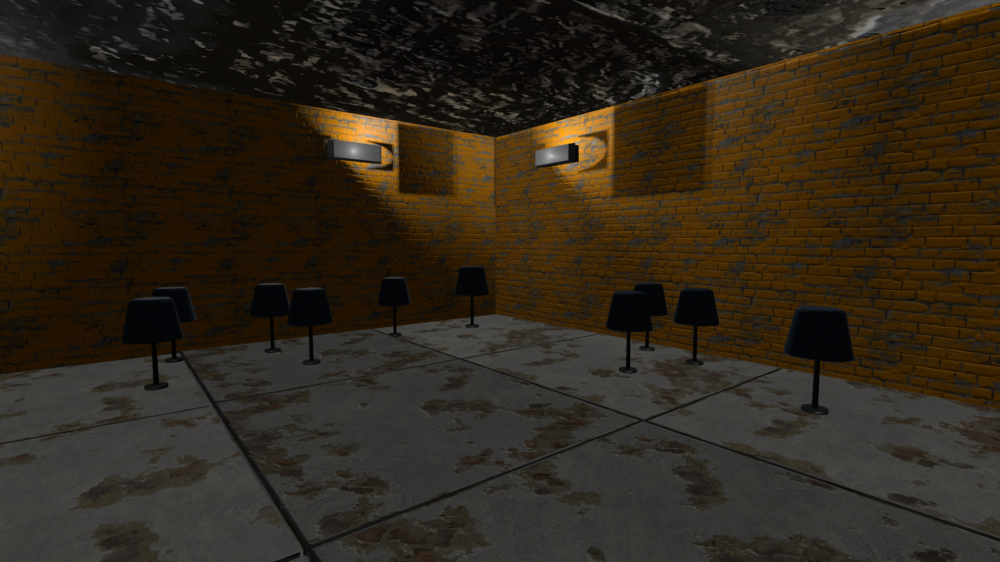
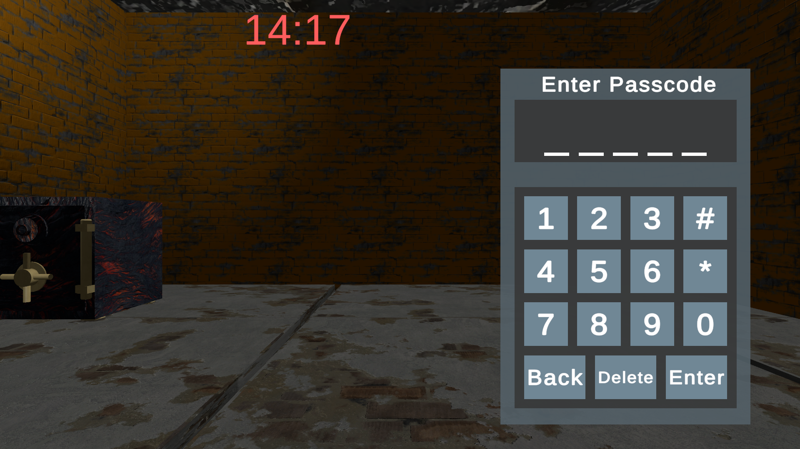

# LD59 UNTITLED ENTRY

  

## OVERVIEW

Short description.

This game is an entry for [__Ludum Dare 59__](https://ldjam.com/events/ludum-dare/59), which starts on _April 17th, 2026_. It was made within 72 hours of the jam.

This `develop` branch is __PROTECTED__, it reflects the currently stable state of the game.

## DESCRIPTION

## CORE GAMEPLAY

## TOOLS:

- Unity 6.3
- Visual Studio Code
- Aseprite
- Audacity

## LINKS

Check out the _jam submission_ page [__here__](https://ldjam.com/events/ludum-dare/57/).

Play it _directly_ or download for your _current platform_ [__here__](https://constance012.itch.io/ld59-dummy-project).

## INGAME CAPTURES

_© 2024-2026 Aforge Studios, all rights reserved._